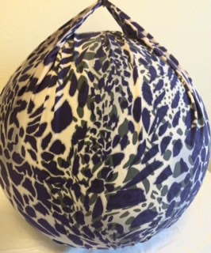
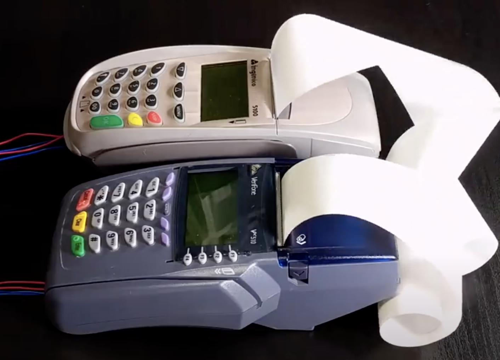

# 1701QCA Making Interaction - Assessment 2 workbook

You will use this workbook to keep track of your progress through the course and also as a process journal to document the making of your projects. The comments in italics throughout the template give suggestions about what to include. Feel free to delete those instructions when you have completed the sections.

When you have completed the template, submit the link to the GitHub Pages site for this repository as a link in Learning@Griffith. The link should be something like [https://qcainteractivemedia.github.io/1701QCA-Assessment2/](https://qcainteractivemedia.github.io/1701QCA-Assessment2/) where `qcainteractivemedia` is replaced with your GitHub username and `1701QCA-Assessment2` is replaced with whatever you called the repository this template is contained in when you set it up.

## Playng a sound Gym ball  ##

## Related projects ##

*Find about 6 related projects to the project you choose. A project might be related through  function, technology, materials, fabrication, concept, or code. Don't forget to place an image of the related project in the appropriate folder and insert the filename in the appropriate places below. Copy the markdown block of code below for each project you are showing.*

### 1.Bop it ###
*https://youtu.be/ayBmsWKqdnc*

This project is related to mine because my project is "musical instrument which react to physical movement". "Bop it" is a classic interactive party toy. All new Bop It calls out commands, the player reacts fast.  It is a game in which sound and body movements linked closely. 
ex;
"Bop It!" becomes the sound of a bass drum.
"Spin It!" becomes the sound of a wobbling wheel.
"Flick It!" becomes a "Boing!" sound.
"Pull It!" becomes the sound of a slide-whistle.
"Twist It!" becomes a cranking sound.
"Shout It!" becomes a DJ's scratching sound.

### 2.Gym ball cover sewing project ###

This project is related to mine because this gave me the idea of fabrication. Initially, it seemed impossible to attach the microbit device on the gym ball. After this finding, it is worth giving it a try with a project.
*https://www.newlittlelife.com/2016/03/12/diy-birth-ball-cover/*

### 3.Failylight ballon ###

This project is related to mine because lighten up the ball is another feature. This product is a general consumer product and, pretty popular.

### 4.LED bouncie  ###
*https://www.instructables.com/id/LED-Bouncie/*

This project is related to mine because, if the light turns on accordant with the ball's movement is perfect.

### 5.Shader-based Physical Modelling Synthesis ###
 *http://www.nime.org/proceedings/2017/nime2017_paper0028.pdf*
 
 This project is very similar to my conceptual design1. However, it is very structured and developed with modern technologies.
 
 ### 6.Device orchestra ###
 *https://youtu.be/8jDROj236R4*
 
 
 This project achieved fun of interactive technologies and music. It is amusing to watch.
 
 
### *Brief resource name/description* ###

*Provide a link, reference, or whatever is required for somebody else to find the resource. Then provide a few comments about what you have drawn from the resource.*

## Conceptual progress ##

### Design intent ###
*Include your design intent here. It should be about a 10 word phrase/sentence.*

### Design concept 1 /Experiment with the relations of SOUNDS & MATERIAL ###

Experiment on how humans react when abnormally occurs in the relations between senses of touching , hearing and sight.

When you touch gravel> it sounds you knock the  wood.
When you touch the sand> it sounds you mix the gravels. etc.. 

 

### Design concept 2 /Musical Gym ball ###

Gym ball plays music and rhythm which synthesize with your movement!

 
 
 ### Design concept 3/ Chasing car ###
people wearing the microbit on his foot. The microbit car is chasing him, and the music changes in dramatic way depend on the distance between them.

 

### Final design concept ###

*This more fully developed concept should include consideration of the interaction scheme, technical functionality, fabrication approach, materials to be used, and aesthetic.*

### Interaction flowchart ###
*Draw a draft flowchart of what you anticipate the interaction process in your project to be. Make sure you think about all the stages of interaction step-by-step. Also make sure that you consider actions a user might take that aren't what you intend in an ideal use case. Insert an image of it below. It might just be a photo of a hand-drawn sketch, not a carefully drawn digital diagram. It just needs to be legible.*

## Physical experimentation documentation ##

*In this section, show your progress including whichever of the following are appropriate for your project at this point.
a.	Technical development. Could be code screenshots, pictures of electronics and hardware testing, video of tests. 
b.	Fabrication. Physical models, rough prototypes, sketches, diagrams of form, material considerations, mood boards, etc.
Ensure you include comments about the choices you've made along the way.*

*You will probably have a range of images and screenshots. Any test videos should be uploaded to YouTube or other publicly accessible site and a link provided here.*

## Design process discussion ##
*Discuss your process in getting to this point, particularly with reference to aspects of the Double Diamond design methodology or other relevant design process.*

## Next steps ##
*Write a list or provide other information about your plan to move the project forward to be ready to present by video and documentation in week 12 of the course.*
