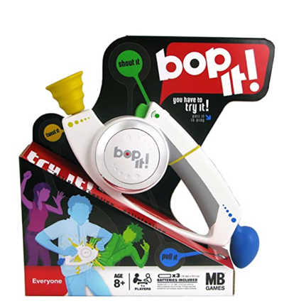
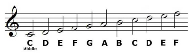
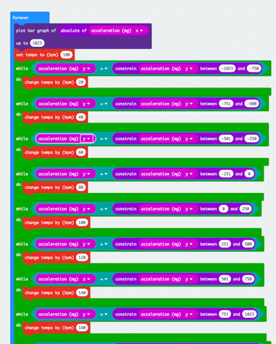
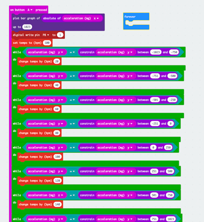

# 1701QCA Making Interaction - Assessment 2 workbook
# Playng a sound Gym ball

## Related projects ##

### 1.Bop it ###

 
[How to play Bop it] *https://youtu.be/ayBmsWKqdnc* 
*This project is related to mine because my project is "musical instrument which react to physical movement". "Bop it" is a classic interactive party toy. All new Bop It calls out commands, the player reacts fast.  It is a game in which sound and body movements linked closely. 
ex;
"Bop It!" becomes the sound of a bass drum.
"Spin It!" becomes the sound of a wobbling wheel.
"Flick It!" becomes a "Boing!" sound.
"Pull It!" becomes the sound of a slide-whistle.
"Twist It!" becomes a cranking sound.
"Shout It!" becomes a DJ's scratching sound.*
 
### 2.Gym ball cover sewing project ###

 
*This project is related to mine because this gave me the idea of fabrication. Initially, it seemed impossible to attach the microbit device on the gym ball. After this finding, it became  worth giving it a try with a project.* 
[How to make yoga ball cover]  https://www.newlittlelife.com/2016/03/12/diy-birth-ball-cover/
 

### 3.Failylight ballon ###

 
This project is related to mine because lighten up the ball is another feature. This product is a general consumer product and, pretty popular.
### 4.LED bouncie  ###

 
 This project is related to mine because, if the light turns on accordant with the ball's movement is perfect.
   
[how to make bouncy ball] *https://www.instructables.com/id/LED-Bouncie/*
 

### 5.Shader-based Physical Modelling Synthesis ###
 
  
   *This project is very similar to my conceptual design1. However, it is very structured and developed with modern technologies.*
    [link to the artickle]*http://www.nime.org/proceedings/2017/nime2017_paper0028.pdf* 
  
### 6.Device orchestra ###

 
 
  [divice orchestra]*https://youtu.be/8jDROj236R4* 
  *This project achieved fun of interactive technologies and music. It is amusing to watch.*

# Conceptual progress #

## Design intent ##
The gym ball makes your daily exercise more fun!
 
## Design concept 1 /Experiment with the relations of SOUNDS & MATERIAL ##
 
Experiment on how humans react when abnormally occurs in the relations between senses of touching , hearing and sight.
Embark the sense of wonder which we normally don't care. 

When you touch gravel> it sounds you knock the  wood.
When you touch the sand> it sounds you mix the gravels. etc..  

 
 

## Design concept 2 /Musical Gym ball ##

Gym ball plays music and rhythm which synthesize with your movement! 

  
 
 ## Design concept 3/ Chasing car ##
people wearing the microbit on his foot. The microbit car is chasing him, and the music changes in dramatic way depend on the distance between them. 

  
 

# Final design concept/ Playng a sound Gym ball #

I wonder if everybody has a gym-ball that he bought for exercise and was left alone. As a "sometimes used chair" in one corner of the room...
This is a tool that transforms such a gym-ball into a ball for fun. This ball plays a music scale, according to the movement of the body.
In order not to limit the movement itself, the aim was to make the loading as simple as possible. Moreover, I would like to make full use of the aesthetic humor of the large gym ball itself—the material of the cover something special that stimulates the texture. 
 
### Interaction flowchart ###
The music is made by mainly using the setting of the accelerator sensor of Microbit. Acceleration x (horizontal movement) senses the scale, acceleration y (vertical movement) senses BPM, that is, the speed of sound. 

  
 
 
 

## Physical experimentation documentation ##

### Trial one ###

[Trial1 movie]*https://youtu.be/eL1vTo0R4Rk*

I tried connecting four speakers, unfortunately ,the overall volume did not change—incorporation with an amplifier is essential.
I research how to attach the amplifier to the microbit. It seemed to do with some soldering work.  It was not realistic for me. So I decided to go with just one stereo speaker. 

And, lots of examination about coding here. I caliculated the amount range to set the "pitch". 

 
I coded with "if true" first, but it didn't work well. I was struggling with how to set the range of the amount acceleration. Depend on the setting, microbit picked just one range ..(played just one key..) 

Finally, I have found the codes; "constrain between A and B" and "while do." These worked quite well. Then I played around with the length of the beat. 
Since It cannot stop the sound once it played, it will pick up the "new/next"data at the point where the sound was cut off. So beat length should be the key to the music. 

 
### Trial 2 ###

https://youtu.be/yqaLaYlwkn0
https://youtu.be/TvU-jmjDYY4

This stage was the learning about "the Kitronik Terminal Block Breakout" This is because that,  it must withstand to big and constant movement.All parts of the electrical circuit should be firmly connected.  Aligator clip might not work.. 
I confirm the speaker and battery connection with terminal block. Then I put this element in the roughly-made cardboard box. I came up with the idea of putting this container in a cloth bag. It worked! 
 
I tried to set up "acceralation y " as BPM. 

### Trial 3 ###

This stage is trial for the fabrication. I designed the container which could hold the parts( terminal board, battery, microbit, stereo speakers, and cables) firmly in the box. These were set up nicely in the box( bit busy though), 

 

 
  

And I  covered up the ball with my old Tshirt, squeezed the container between the Tshirt and the gym ball. ! it worked! However, the problem was that sound was just too small.. it was not fun at all! 

 
  

[trial 3 video] https://youtu.be/lQGHr2OlBq8 

### Trial 4 ###

[Trial 4 video] https://youtu.be/JYrxbIS80yw

This stage is the brushing up the fablication and coding. 
I saw the cover with sewing machine.
 
 
 
 
 

Then, in order to try the LED would work with or not, I tested with fairly light.
It worked well with the direct connection with aligator pin with microbit. 
 
 
  
However, it did not work with terminal block.. So, for this stage I needed to give up.  
 
  
but I made sure the light could fit into the ball. There is a possibility to put the NEOPIXEL in the ball. 
 
 
Coding 

Being struggle with making the switch on/off with code, I asked advice during the class time.  Unfortunately, it did not work. For the next stage, I should look at the solution.  
 

Then the following is the final code for this prototype.  
 
 

## Design process discussion ##
*DISCOVER:
The initial stage, I tried to figure out what I could achieve to the maximum in this COVID19 situation; luck or materials and parts, limited chance to ask onsite technical help. Therefore, as a start,  I decided to explore the material and something "interesting " in the house.
And I checked out several online shops to check out the stock and delivery time range. In general, they do "next business day delivery", however, now it was going to take around 10 days. I found out the timeline and preparation are essential. 

DEFINE:
As the conversation with the teacher, classmate, and tutor through the discussion board and the online class. Then, I conducted researching more further on their feedbacks. This process hugely contributed to decision making.

DEVELOP
Once I decided on the product., I conducted researching material, coding, electrical circuit development, etc. The most disappointing thing is that I have minimal knowledge of electronics and coding. I wish I could have more time to learn these basics. 

DELIVER
I did four trials so far. Throughout the trials, I always find the improvement points. The product is brushed up little by little.  I have been back and forth, endlessly  "Develop"  and "Deliver" stages.*

## Next steps ##

1.Explore and Reserch about the how to make "bouncy ball"
2.Explore and Reserch about "Neopixel"
3.Establish the switch sytem
4.Make Microbit container smaller , thinner and lighter. My goal is the container could tack in the pocket of the cover.
5.Get the unique material for the cover.
6. Estblish more loud soundsystem with "MONK MAKES Speaker"
